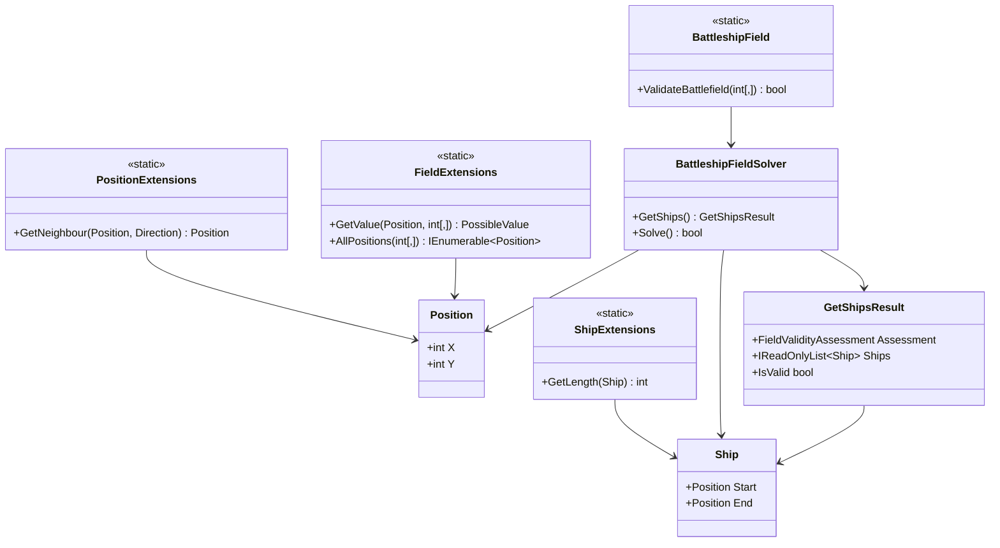

# Battleship Field Validator

## Code Structure

```mermaid
classDiagram
    class Position {
        +int X
        +int Y
    }

    class Ship {
        +Position Start
        +Position End
    }

    class GetShipsResult {
        +FieldValidityAssessment Assessment
        +IReadOnlyList~Ship~ Ships
        +IsValid bool
    }

    class PositionExtensions {
        <<static>>
        +GetNeighbour(Position, Direction) Position
    }

    class ShipExtensions {
        <<static>>
        +GetLength(Ship) int
    }

    class FieldExtensions {
        <<static>>
        +GetValue(Position, int[,]) PossibleValue
        +AllPositions(int[,]) IEnumerable~Position~
    }

    class BattleshipField {
        <<static>>
        +ValidateBattlefield(int[,]) bool
    }

    class BattleshipFieldSolver {
        +GetShips() GetShipsResult
        +Solve() bool
    }

    PositionExtensions --> Position
    ShipExtensions --> Ship
    FieldExtensions --> Position
    BattleshipField --> BattleshipFieldSolver
    BattleshipFieldSolver --> Position
    BattleshipFieldSolver --> Ship
    BattleshipFieldSolver --> GetShipsResult
    GetShipsResult --> Ship
```