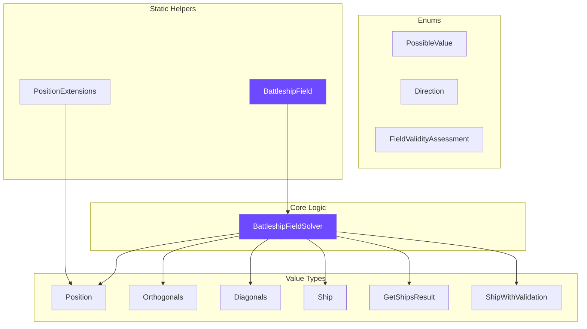

## Code Structure

```mermaid
graph TD
    subgraph Enums
        E1[PossibleValue]
        E2[Direction]
        E3[FieldValidityAssessment]
    end
    
    subgraph Value Types
        V1[Position]
        V2[Orthogonals]
        V3[Diagonals]
        V4[Ship]
        V5[GetShipsResult]
        V6[ShipWithValidation]
    end
    
    subgraph Static Helpers
        S1[PositionExtensions]
        S2[BattleshipField]
    end
    
    subgraph Core Logic
        C1[BattleshipFieldSolver]
    end
    
    S1 --> V1
    S2 --> C1
    C1 --> V1
    C1 --> V2
    C1 --> V3
    C1 --> V4
    C1 --> V5
    C1 --> V6
    
    style C1 fill:#6d4aff,color:#fff
    style S2 fill:#6d4aff,color:#fff
```